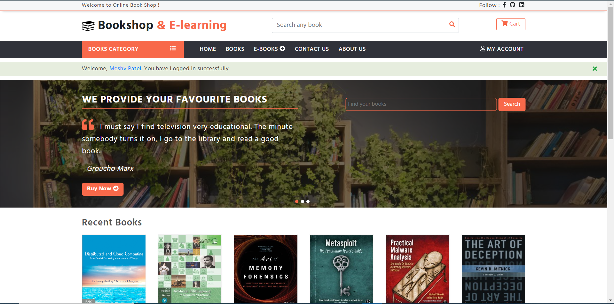
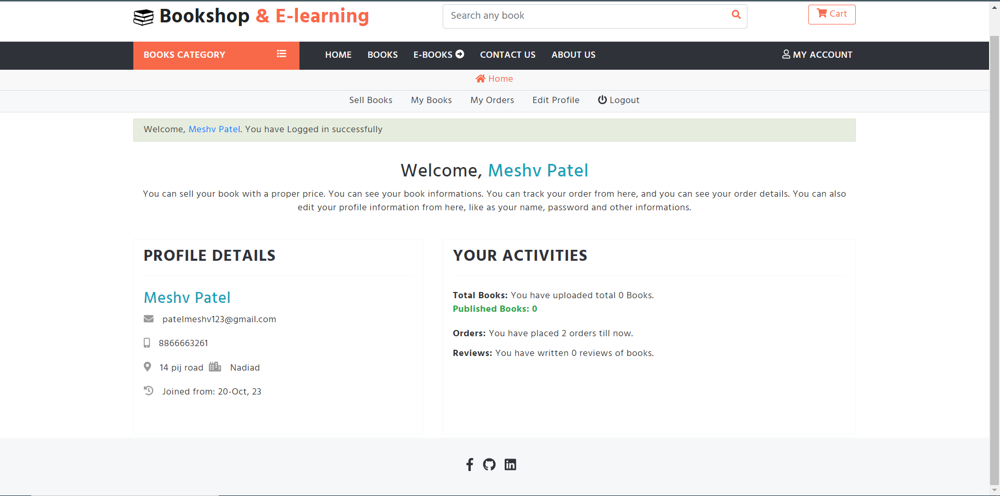
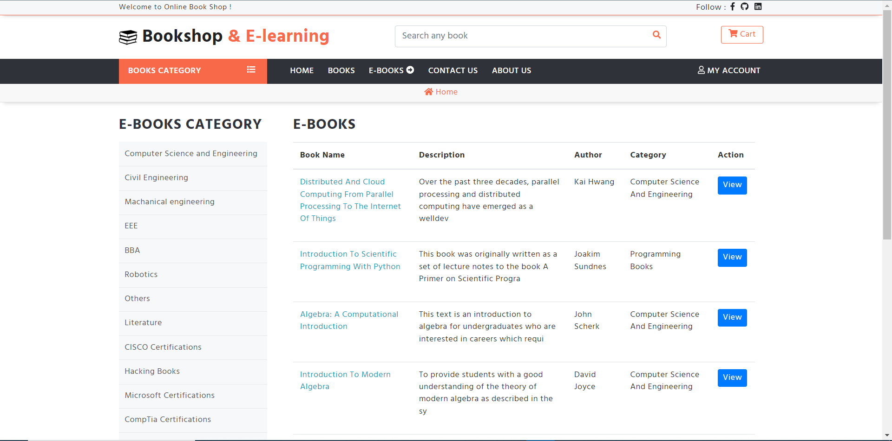
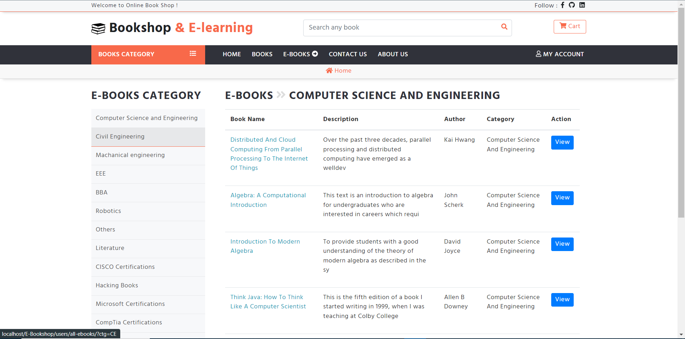

# E- Book Shop

The Universal e-Bookstore is an innovative digital platform designed for avid readers, providing them with convenient access to a vast library of e-books from various genres and authors. This project is aimed at creating a seamless reading experience, allowing users to access and read their favorite books anytime, anywhere, on a variety of devices.

## Features

Extensive Library: The e-bookstore offers a comprehensive collection of e-books, including bestsellers, classics, niche genres, and self-published works. Readers can find a wide range of literary content to suit their preferences.

Cross-Platform Access: The e-bookstore is accessible through web browsers, ensuring readers can enjoy their books on any device with internet connectivity.

User-Friendly Interface: The platform is designed with a user-friendly web interface, enabling easy navigation, book discovery, and personalized recommendations based on user preferences and reading history.

Search and Filtering: Users can search for specific books, authors, or genres and apply filters to refine their book choices. Advanced search functionality makes it easy to find exactly what they're looking for.

Offline Reading: Readers can download e-books for offline access, making it possible to enjoy their favorite titles even without an internet connection.

Personalized Bookshelves: Users can create personalized bookshelves within their web-based accounts to organize and manage their e-book collections. They can also add notes, bookmarks, and highlight text for reference.

Social Features: The platform includes social sharing options, book reviews, and the ability to connect with friends, discuss books, and recommend titles to one another.

Continuous Updates: The e-bookstore regularly updates its catalog to add new releases and provide the latest titles to keep readers engaged and excited.

Data Security and Privacy: The platform ensures the security and privacy of user data and reading history, with robust data encryption and privacy settings, all within the web-based environment.

The Universal e-Bookstore project aims to create a versatile and accessible digital reading environment, empowering readers to explore, enjoy, and immerse themselves in the world of literature through a user-friendly website accessible on any internet-connected device.

## Screenshots

